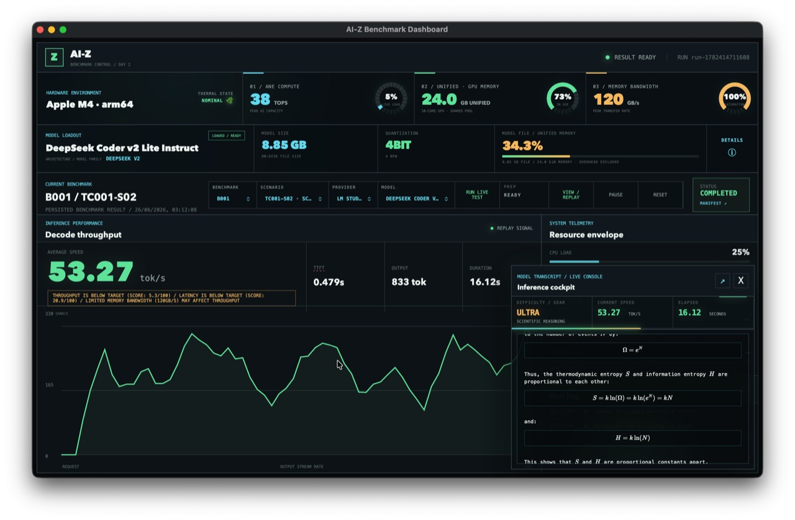
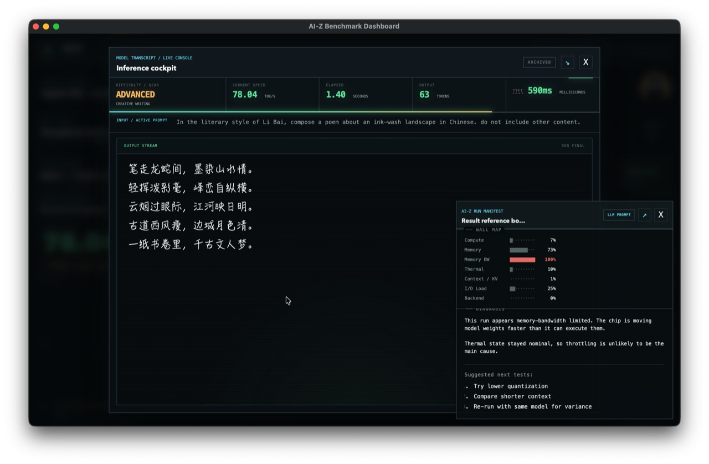
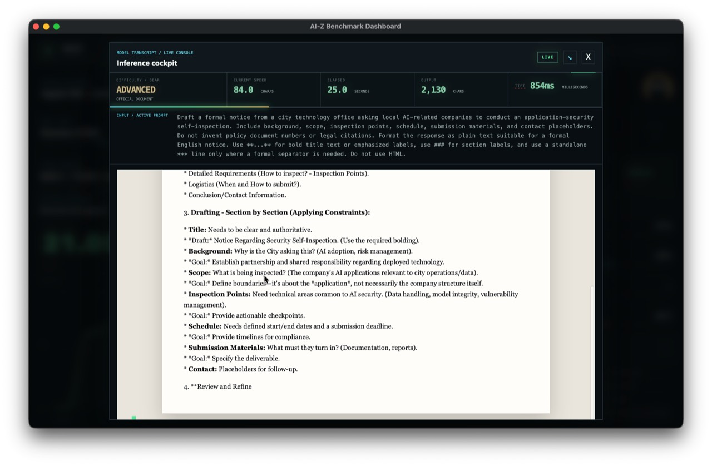
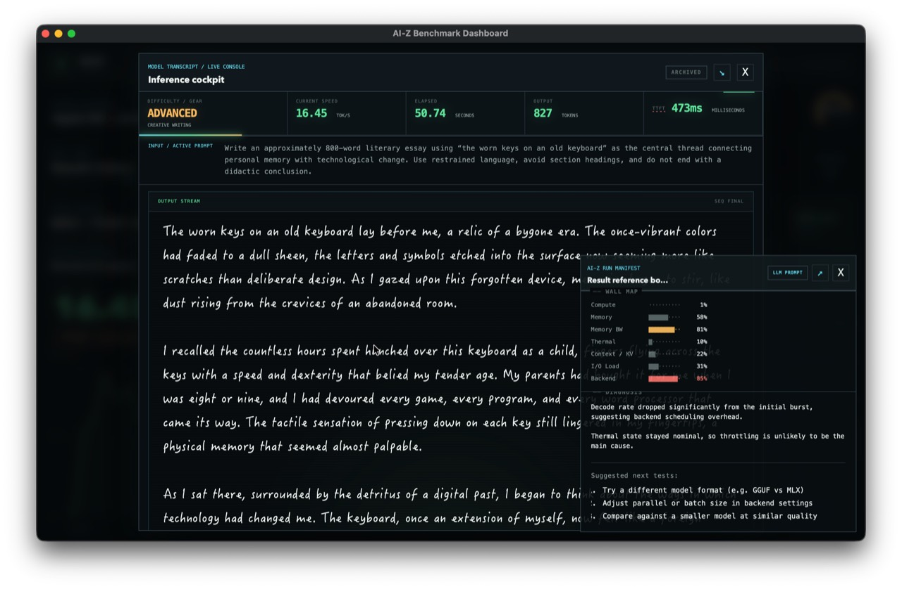
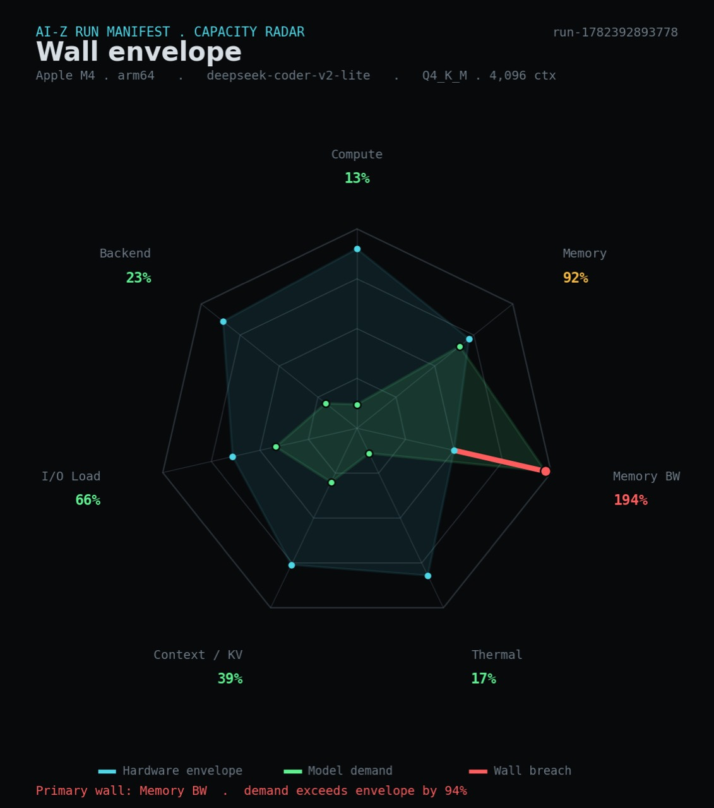
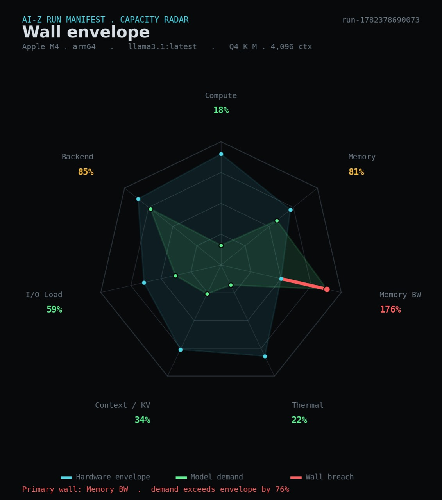
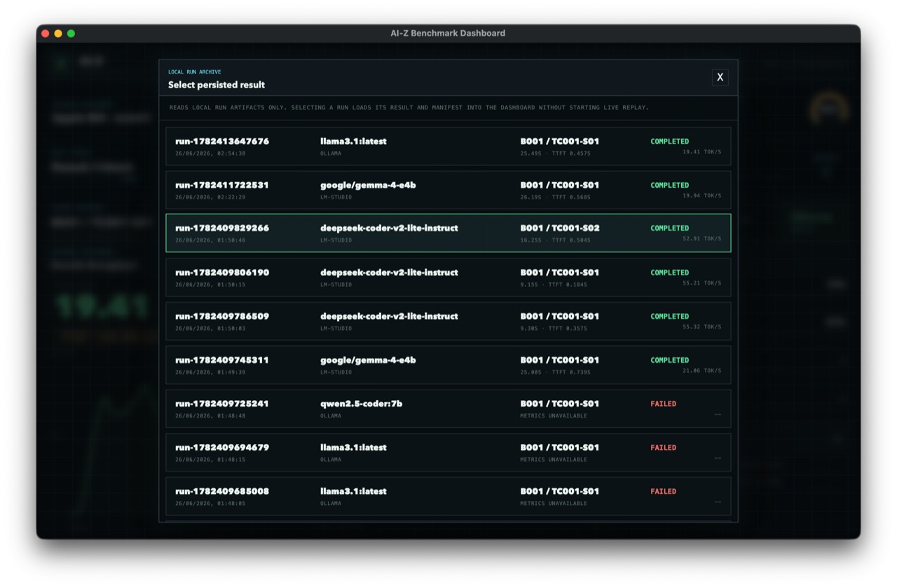

# AI-Z User Guide

Community: join [AI-Z Discussions](https://github.com/TerrenceYeYang/AI-Z/discussions) for questions, benchmark results, model/provider comparisons, and Human-Z roadmap discussion. Start with the [welcome thread](https://github.com/TerrenceYeYang/AI-Z/discussions/1).

> [!IMPORTANT]
> **macOS first launch notice**
>
> AI-Z alpha builds are ad-hoc signed and not Apple-notarized yet. If macOS blocks the app after download, use one of these two methods:
>
> **Method 1: Finder approval**
> 1. Open Finder and locate `AI-Z.app`.
> 2. Hold `Control` and click the app, or right-click it, then choose `Open`.
> 3. In the warning dialog, choose `Open Anyway` if it appears.
> 4. macOS will remember this approval for future launches.
>
> **Method 2: remove quarantine from Terminal**
> ```bash
> xattr -dr com.apple.quarantine /path/to/AI-Z.app
> open /path/to/AI-Z.app
> ```
> Replace `/path/to/AI-Z.app` with the actual path to the downloaded app.

AI-Z is a local AI benchmark dashboard for measuring how your machine runs local language models. It connects to a local OpenAI-compatible runtime, runs repeatable text-generation scenarios, and saves the result on your computer.



This guide is written for end users. For architecture and development notes, see the main project README.

## What AI-Z Measures

AI-Z focuses on practical local inference behavior:

- Time to first token, shown as TTFT.
- Output speed, shown as tokens per second.
- Total run duration and completion status.
- CPU and memory telemetry during the run.
- Model identity, size, quantization, and memory fit.
- A local score for the selected benchmark scenario.

The current benchmark family is `TC001`, a set of text-generation scenarios covering Q&A, reasoning, code generation, professional writing, creative writing, and technical advice.



## Requirements

Before running a live benchmark, start one supported local model runtime:

- LM Studio with its local server enabled at `http://127.0.0.1:1234/v1`
- Ollama running at `http://127.0.0.1:11434/v1`

AI-Z discovers both automatically. If both are available, AI-Z prefers LM Studio by default, but you can select the provider and model in the dashboard.

AI-Z does not include, download, or install models. Prepare a local text-generation model in LM Studio or Ollama first.

## Quick Start

1. Start LM Studio or Ollama.
2. Make sure at least one local text-generation model is available.
3. Open `AI-Z.app`.
4. Wait for the `PROVIDER` and `MODEL` menus to show available options.
5. Select a benchmark, scenario, provider, and model.
6. Click `RUN LIVE TEST`.
7. Use `MANIFEST` to review the run summary, or `VIEW / REPLAY` to open saved local results.

On the first launch, macOS may block an unsigned app. If that happens, right-click `AI-Z.app`, choose `Open`, and confirm. You can also allow it from `System Settings -> Privacy & Security`.



## Runtime Setup

### LM Studio

1. Open LM Studio.
2. Download or select a local chat or text-generation model.
3. Enable the local server.
4. Confirm the server address is `http://127.0.0.1:1234/v1`.
5. Keep LM Studio running, then open AI-Z.

### Ollama

Install or start Ollama, then pull a model:

```bash
ollama pull qwen2.5-coder:7b
```

If Ollama is not already running, start it:

```bash
ollama serve
```

AI-Z expects Ollama's OpenAI-compatible endpoint at:

```text
http://127.0.0.1:11434/v1
```

## Dashboard Controls

- `BENCHMARK`: selects the scoring recipe.
- `SCENARIO`: selects the prompt/task scenario.
- `PROVIDER`: selects LM Studio or Ollama.
- `MODEL`: selects the discovered local model.
- `RUN LIVE TEST`: starts a real local benchmark run.
- `VIEW / REPLAY`: opens saved local benchmark results.
- `MANIFEST`: opens the run summary, metadata, and diagnostic notes.

By default, AI-Z resets resident local models and sends one unscored warm-up request before the measured run. This keeps routine comparisons focused on steady local inference behavior.



## Understanding Results

- `AVERAGE SPEED`: average generation speed in tokens per second. Higher usually means faster output.
- `TTFT`: time to first token. Lower means the model starts responding sooner.
- `OUTPUT`: number of output tokens generated during the run.
- `DURATION`: total run time.
- `CPU / MEMORY / GPU / THERMAL`: system telemetry collected during the run.
- `MODEL FILE / UNIFIED MEMORY`: model file size compared with unified memory. This is a planning baseline, not exact runtime memory usage. KV cache, context length, parallelism, and backend overhead can use additional memory.

For cleaner comparisons, run the same model and scenario more than once. First runs can be affected by model loading, cache state, background apps, and temperature.

<p>
  
  
</p>

## Saved Results

AI-Z saves completed run artifacts locally. On macOS, results are typically written under:

```text
~/Library/Application Support/com.aiz.benchmark/
```

Each run is stored under:

```text
runs/<run-id>/
```

Completed runs include:

- `result.json`: final benchmark result and metadata.
- `events.jsonl`: append-only event stream for replay and diagnostics.



Deleting the app does not necessarily delete saved benchmark results.

## Privacy

AI-Z is designed for local benchmarking. It connects to local runtime addresses by default:

- `http://127.0.0.1:1234/v1` for LM Studio
- `http://127.0.0.1:11434/v1` for Ollama

Benchmark prompts, model outputs, telemetry, and saved artifacts stay on your machine unless you manually share them. Your selected runtime still controls model execution, so review LM Studio or Ollama settings separately if you use custom networking, remote endpoints, or runtime telemetry.

## Troubleshooting

### No provider appears

Make sure LM Studio or Ollama is running and listening on its default local port. LM Studio uses `1234`; Ollama uses `11434`.

### A provider appears, but no model appears

Make sure the runtime has at least one local text-generation model available. Embedding-only or unsupported model types may not appear as runnable benchmark models.

### A live run fails

Confirm the selected model can answer a normal request in LM Studio or Ollama. If the runtime was just restarted or a model was unloaded, wait a moment and try again.

### The first run is slower than later runs

This is normal. First runs can include model loading, memory mapping, cache setup, or backend warm-up costs.

### The Mac gets hot or slows down

Local model inference can use substantial CPU, GPU, and unified memory. For more stable results, connect power, improve cooling, close heavy background apps, and wait for the machine to cool before repeating a test.

### Saved results are empty

Only runs that start and produce artifacts appear in `VIEW / REPLAY`. A fresh install with no completed benchmark runs will have an empty history.

## Build From Source

Developers can build the desktop app from the repository:

```bash
cd apps/aiz_desktop
npm install
npm run bundle
```

The portable macOS app is written to:

```text
target/release/bundle/macos/AI-Z.app
```

## License

MIT
